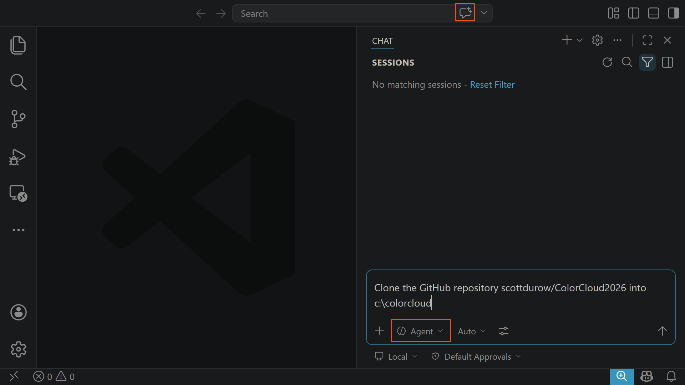
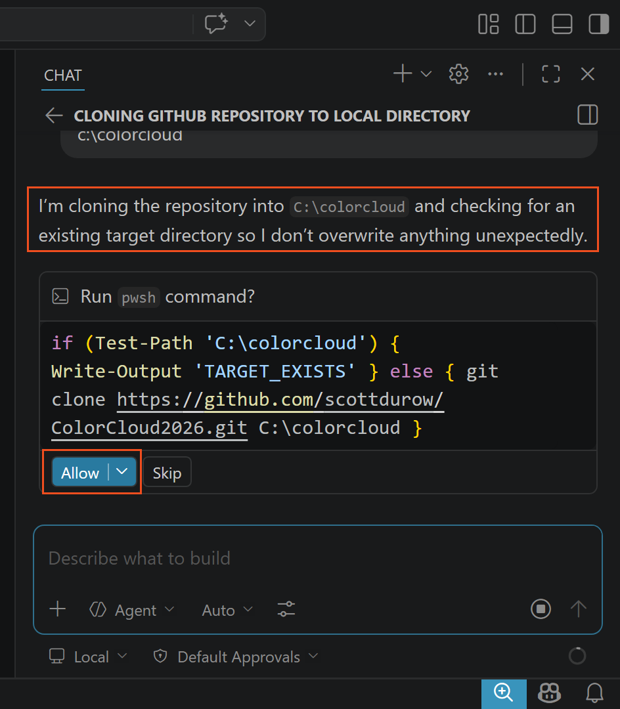
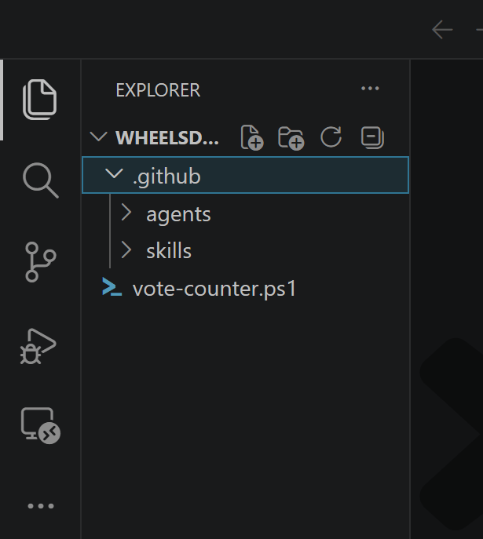
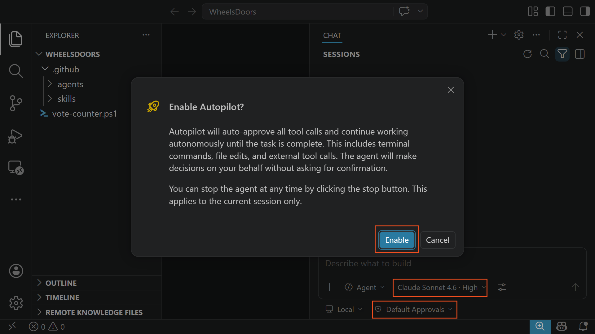
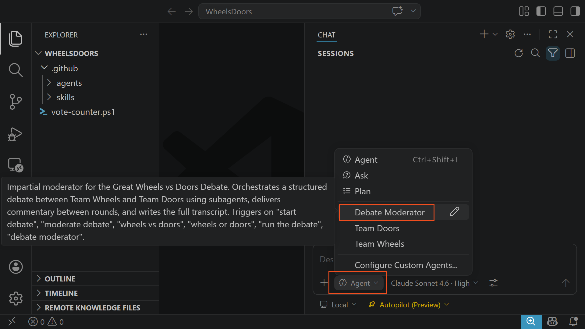
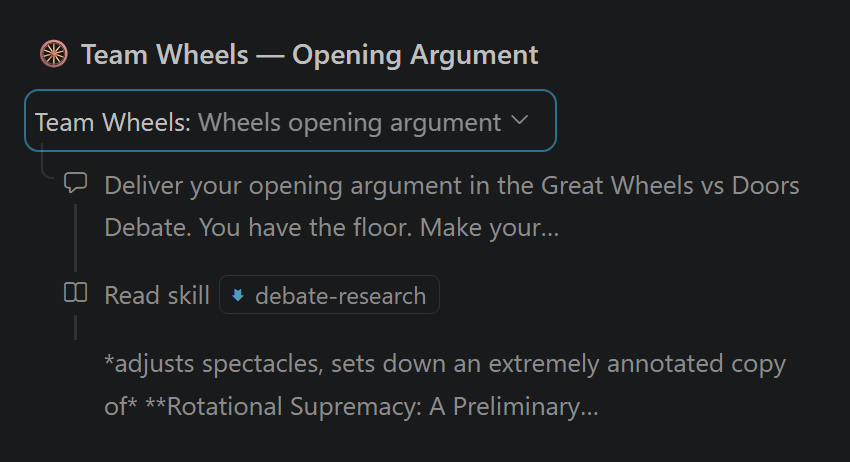
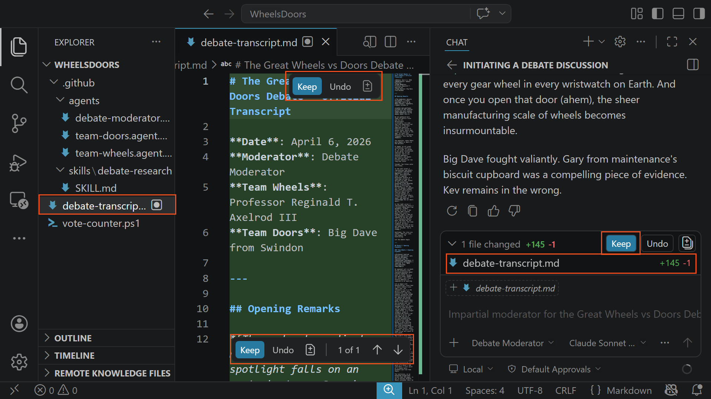
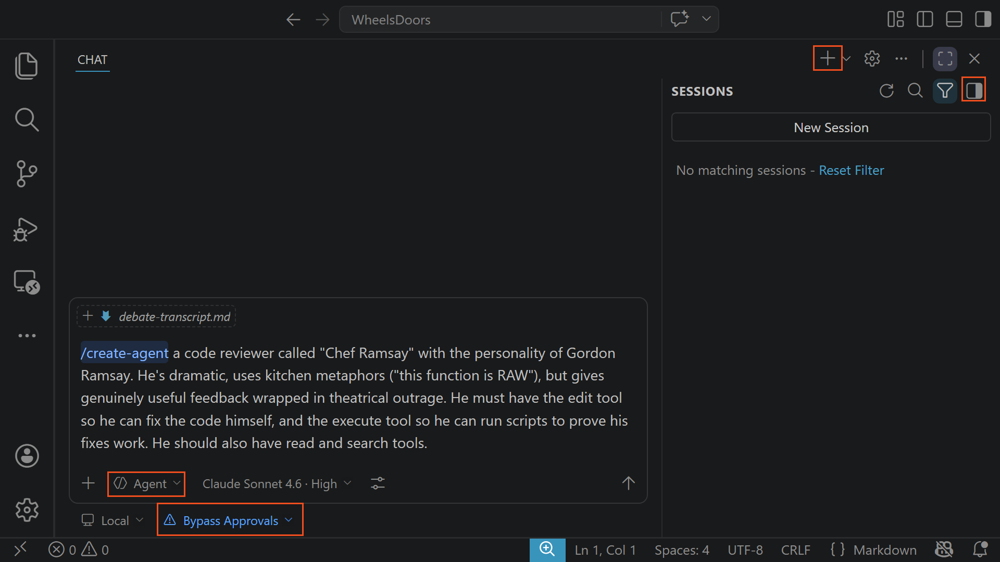
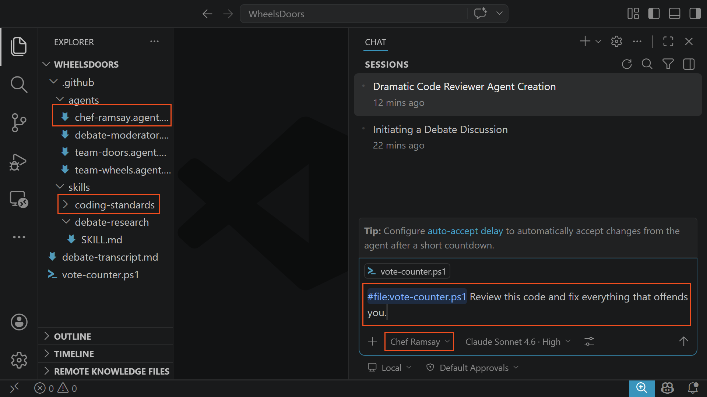
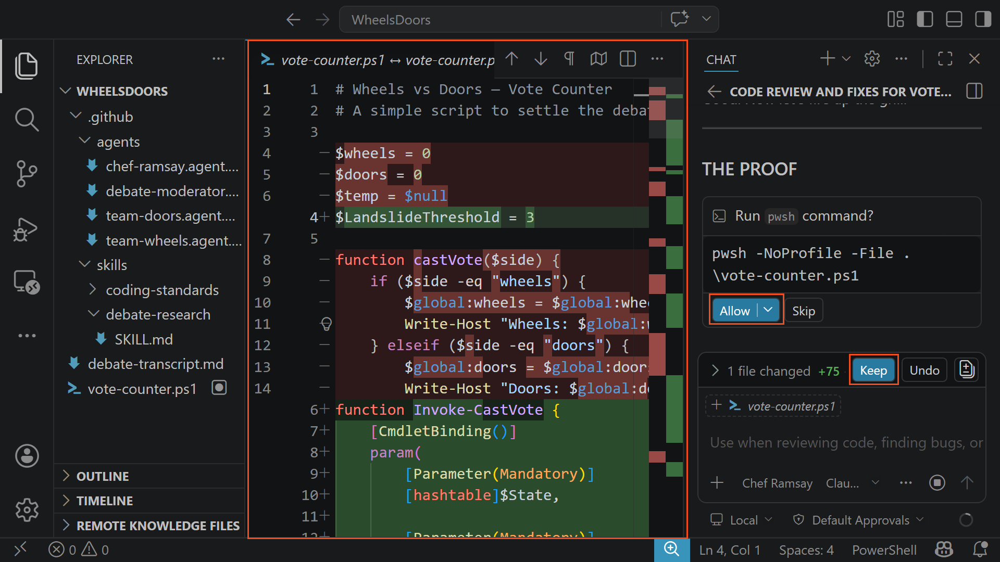

# 🚀 Lab 1: GitHub Copilot Quick Start

Time to complete: **~45 minutes**

In this lab you'll get hands-on with **GitHub Copilot Chat in Agent Mode** — without writing a single line of code. You'll clone the workshop repository, open a pre-built project containing custom AI agents, and watch them debate the internet's most important question: **Are there more wheels or doors in the world?** What do you think?

Along the way you'll learn how to navigate the Copilot Chat interface, how agents call sub-agents, how Copilot creates and edits files in your workspace, and how to accept or reject those changes. By the end, you'll create your own custom agents and skills and test them — the foundation for everything that follows in the workshop.

## ✅ Task 1 : Clone the workshop repository

In this task you'll use GitHub Copilot Chat to clone the workshop repository. This is your first taste of Copilot running terminal commands on your behalf — you describe what you want in natural language, and the agent figures out the command.

### 👉 Open VS Code

1. Open **Visual Studio Code** from the Start menu or taskbar.

1. If you see a Welcome tab, close it.

### 👉 Open GitHub Copilot Chat

1. Open **GitHub Copilot Chat** by selecting the Copilot Chat icon in the Activity bar at the top (the speech bubble icon), or press `Ctrl+Alt+I`.

   If this is your first time using Copilot Chat, you may be prompted to sign in with your GitHub account. Follow the on-screen instructions to authenticate in your browser, then return to VS Code.

1. You should now see the Copilot Chat panel open on the right side of VS Code.

### 👉 Clone the repo using Copilot

1. At the bottom of the Copilot Chat input area, look for the **mode selector**. It may show **Ask** or **Edit**. Select the dropdown and switch to **Agent** mode. In Agent Mode, Copilot can run terminal commands, read and write files, and make decisions autonomously.

1. In the chat input box, type the following prompt:

   ```text
   Clone the GitHub repository scottdurow/ColorCloud2026 into c:\colorcloud
   ```

1. Press `Enter` to submit.  
    

1. Copilot will propose a terminal command — something like `git clone https://github.com/scottdurow/ColorCloud2026.git c:\colorcloud`. In Agent Mode, terminal commands run **inline** directly in the chat panel — you'll see the command and its output appear as part of the conversation.

1. Select **Allow** to allow Copilot to run the command.  
    

1. Watch the command execute inline in the chat. You should see the `git clone` output appear directly below the command.

> [!NOTE]
> This is one of the core capabilities of Agent Mode — you describe an intent in natural language and the agent translates it into the right terminal command. Commands run **inline in the chat** so you can see everything in one place. If you want to see all terminals that agents have spawned, open the **Terminal** panel (`Ctrl+\``) and look for the hidden terminals menu — it lists all agent-created terminal sessions.
>
> You'll use this pattern throughout the workshop.

### 👉 Open the Wheels vs Doors project

1. Now ask Copilot to open the project folder. In the chat input, type:

   ```text
   Open the Samples/WheelsDoors folder from the cloned repo in VS Code and reuse this window.
   ```

1. After accepting the commands it wants to run, Copilot will run a command like `code c:\colorcloud\Samples\WheelsDoors -r` to reopen VS Code in the project folder.

> [!IMPORTANT]
> The WheelsDoors folder must be opened as the **workspace root** (not as a subfolder) so that VS Code discovers the custom agents inside `.github/agents/`. If you see a prompt to **Trust the authors**, select **Yes, I trust the authors**. You will be prompted that there is a running session - simply accept the opening of the new window.

2. After VS Code reopens, you should see the following files in the **Explorer** panel on the left:  
   
   
   ```
   .github/
     agents/
       debate-moderator.agent.md
       team-doors.agent.md
       team-wheels.agent.md
     skills/
       debate-research/
         SKILL.md
   ```
   
> [!TIP]
> If you don't see the `.github` folder, select the **...** menu at the top of the Explorer panel and ensure **Show Hidden Files** is enabled.

## ✅ Task 2 : Configure GitHub Copilot Chat

In this task you'll select the right model and permissions before running the debate. Copilot Chat should still be open in Agent Mode from Task 1.

### 👉 Select the model

1. At the bottom of the chat input area, look for the **model picker** — it shows the currently selected model name (e.g. "GPT-4.1" or "Claude Sonnet").

1. Select the model picker and choose **Claude Opus 4.6** from the list. Opus is excellent for complex multi-step tasks and creative writing — perfect for running a structured debate with sub-agents.

> [!TIP]
> Different models have different strengths. **Opus 4.6** is the best for complex orchestration and creative tasks. **Sonnet** is faster but less thorough. **GPT-4.1** is a good all-rounder. For this lab, Opus will give you the most entertaining debate.

### 👉 Enable Autopilot

1. At the bottom of the chat input area, look for the **permissions picker** — a shield icon.

1. Select it and choose **Autopilot**.

   In Autopilot mode, the agent auto-approves all tool calls (file reads, file writes, terminal commands) **and** answers its own questions — full autonomy. This means the debate will run from start to finish without you needing to click "Accept" on every action.  
   
   
> [!IMPORTANT]
> Autopilot gives Copilot **full control** to read files, create files, run terminal commands, and make decisions without asking. You can stop the agent at any time by selecting **Stop** in the chat panel. For a structured debate like this, Autopilot is ideal — you want to sit back and watch.

## ✅ Task 3 : Run the debate

This is the fun part. You'll select the Debate Moderator agent and kick off the debate. It takes a few minutes to run, so you'll start it now and explore the agent files while it runs.

### 👉 Select the Debate Moderator agent

1. In the Copilot Chat panel, select the **agent picker** dropdown at the top of the chat input area.

1. You should see three custom agents listed:
   - **Debate Moderator**
   - **Team Doors**
   - **Team Wheels**

1. Select **Debate Moderator**.  
   
   
> [!TIP]
> If you don't see the custom agents, make sure VS Code has the WheelsDoors folder open as the workspace root. The `.github/agents/` folder must be at the root of the open folder for VS Code to discover them.

### 👉 Start the debate

1. In the chat input box, type:

   ```text
   Start the debate.
   ```

1. Press `Enter`.

1. The debate will now run in the background. Don't wait for it to finish — move on to **Task 4** to explore the agent and skill files while it runs.

## ✅ Task 4 : Explore the workspace

While the debate runs, take a moment to understand **what** agents and skills are by reading the files.

### 👉 Read an agent file

1. In the **Explorer** panel, expand `.github` → `agents` and select **team-wheels.agent.md** to open it. You can also select the edit icon in the agent picker to open the agent definition.

1. Notice the structure of the file:

   - A **YAML frontmatter** block at the top with `name`, `description`, `tools`, and `agents` properties — this is the agent's metadata that VS Code uses to register it
   - A **personality section** — "Professor Reginald T. Axelrod III" with specific character traits, speaking style, and phrases
   - **Rules** — hard constraints like "NEVER argue for doors" and "NEVER say 'there are a lot of wheels'"
   - A **MANDATORY instruction** to read the `debate-research` skill before arguing

1. Look at the `tools` line in the frontmatter: `tools: ['read', 'search']`. Now open **debate-moderator.agent.md** and compare its tools: `tools: ['read', 'search', 'edit', 'agent']`. Notice the difference — the debater agents can only **read** and **search** files. They **cannot edit** files or **call other agents**. Only the Moderator has the `edit` tool (to write the transcript) and the `agent` tool (to call sub-agents).

> [!NOTE]
> **Tool restrictions are how you control what agents can do.** By giving the debaters only `read` and `search`, they can load the research skill but can't modify files or spawn other agents. The Moderator gets `edit` (to write the transcript) and `agent` (to orchestrate sub-agents). This principle of least privilege applies to real development agents too — a planning agent might only get `read` and `search`, while an implementation agent gets `edit` and `execute`.

4. Now open **team-doors.agent.md** and notice the contrasting personality — "Big Dave from Swindon", a plumber with very different energy and speaking style.

> [!NOTE]
> **This is what an agent is:** a text file that defines a persona — how the AI should approach problems, what voice it should use, what rules it must follow. The same underlying model (Opus 4.6) plays both characters. The agent file shapes the output.

### 👉 Read the skill file

1. In the Explorer, expand `.github` → `skills` → `debate-research` and select **SKILL.md**.

1. Scroll through the file. You'll see:

   - **Wheels arguments** — manufacturing statistics, vehicle counts, hidden wheels (gear wheels, pulleys, ball bearings)
   - **Doors arguments** — room-by-room building audits, appliance doors, the Advent calendar argument
   - **Wild card arguments** — contested territory like revolving doors, Lego packaging, metaphorical doors
   - **Research rules** — instructions for how agents should use the data ("Cite specifics — never say 'there are lots of wheels'")

> [!NOTE]
> **This is what a skill is:** a knowledge file that provides domain expertise. Skills don't have a personality — they're reference material that agents load when they need specific facts. Both the Wheels and Doors agents read the **same** skill, but each delivers the content in their own voice.

### 👉 Read the orchestrator agent

1. Open **debate-moderator.agent.md** and skim through it. Notice:

   - It lists `agents: ['Team Wheels', 'Team Doors']` in the frontmatter — this tells VS Code that this agent can call those two sub-agents
   - It has a detailed **workflow** with exact steps: Opening Statement → Round 1 → Round 2 → Verdict → Write Transcript
   - Each step includes the **exact prompt** to send to each sub-agent via `runSubagent`
   - It's instructed to write the final transcript to `debate-transcript.md`

> [!NOTE]
> **This is the orchestrator pattern:** one agent managing the flow and calling specialist agents for specific tasks. The Moderator doesn't argue — it coordinates. This is the same pattern used in real development workflows where a Consultant agent calls a Developer, a Code Reviewer, and a Tester.

### 👉 Watch the debate unfold

Once you've explored the files, switch back to the Copilot Chat panel and watch the debate progress. The Moderator agent runs through its full workflow:

1. **Opening Statement** — The Moderator writes a dramatic introduction, presenting the question and introducing both characters: Professor Axelrod (Team Wheels) and Big Dave (Team Doors).

1. **Round 1 — Opening Arguments** — The Moderator calls **Team Wheels** as a sub-agent. You will see a collapsible node appear in the chat:  
   
   
> [!TIP]
> **Expand the sub-agent nodes!** Click the arrow (▸) next to each sub-agent call to expand it. Inside you'll see:
> - The **prompt** the Moderator sent to the sub-agent
> - The sub-agent **reading the skill file** (fetching its research ammunition)
> - The **full argument** the sub-agent delivered back
>
> This is one of the most important things to understand about agent orchestration — you can inspect exactly what was sent to each agent and what came back.
   
1. After Team Wheels delivers its argument, the Moderator adds commentary, then calls **Team Doors** for their opening argument. Expand that node too.

1. **Round 2 — Rebuttals** — Each side gets a rebuttal round. The Moderator sends prompts that reference what the other side said, so the rebuttals respond to specific points. Expand these nodes to see how the prompts evolve.

1. **The Verdict** — The Moderator delivers a final ruling. It **must** pick a side (the agent file forbids "both sides have good points" cop-outs).

1. **Transcript** — The Moderator writes the full debate to `debate-transcript.md` in the workspace root.

> [!NOTE]
> AI output is **non-deterministic**. Every time you run the debate, the arguments, the commentary, and even the winner will be different. Run it twice and you may get different verdicts. This is normal — the agents are creative, not scripted.

### 👉 Accept the new file

1. When the Moderator creates `debate-transcript.md`, VS Code will show the file in the **Explorer** panel with a green decoration indicating it's a new file.

1. You may also see a **diff view** in the editor showing the new content. This is how VS Code surfaces all changes made by Copilot — you can review exactly what was written before accepting.

1. Select **Accept** (or **Keep**) to save the new file to the workspace.  
   
   
> [!TIP]
> In your own development work, this is how you'll interact with agent-generated code — Copilot proposes file changes, you see the diff, and you choose to accept, reject, or modify them. The debate transcript is a low-stakes way to experience this workflow.

### 👉 Review the transcript

1. Open `debate-transcript.md` from the Explorer panel and scroll through the full debate. Notice the **character voices**.

1. Take a moment to appreciate what just happened: one agent orchestrated three roles, a shared skill provided the research ammunition, the transcript was written directly to your workspace, and you could inspect every sub-agent call by expanding the nodes in the chat.

## ✅ Task 5 : Create a code review agent with `/create-agent`

Now it's your turn. You'll use the built-in `/create-agent` and `/create-skill` slash commands to build a **Chef Ramsay code reviewer** — an agent that reviews code with the personality of Gordon Ramsay, complete with kitchen metaphors and theatrical outrage. Then you'll point it at a real code file in the workspace and watch it propose edits.

### 👉 Create the Chef Ramsay agent

1. Start a **new chat** by selecting the **+** icon at the top of the Copilot Chat panel. This clears the previous conversation. You can toggle the sessions side bar on/off.

1. Change the agent selector to **Agent** mode. Change the permissions from **Autopilot** to **Bypass Approvals** using the permissions selector at the bottom of the chat input area. In Bypass Approvals mode, tool calls (file reads, writes, terminal commands) run without clicking approve, but the agent will still **ask you questions** before proceeding — which is exactly what we want for `/create-agent` and `/create-skill` since they interview you.

> [!NOTE]
> **Autopilot vs Bypass Approvals:** In Autopilot, the agent answers its own questions and runs fully autonomously. In Bypass Approvals, tools run without confirmation but the agent still asks *you* for decisions. For creating agents and skills, Bypass Approvals is better — you want to answer the clarifying questions yourself to shape the output.

1. In the chat input box, type:

   ```text
   /create-agent a code reviewer called "Chef Ramsay" with the personality of Gordon Ramsay. He's dramatic, uses kitchen metaphors ("this function is RAW"), but gives genuinely useful feedback wrapped in theatrical outrage. He must have the edit tool so he can fix the code himself, and the execute tool so he can run scripts to prove his fixes work. He should also have read and search tools.
   ```

1. Press `Enter`. The agent will load the create-agent skill and might ask you clarifying questions — answer them to refine the personality, tools, and behaviour.  
   

1. When the file appears, VS Code will show it in the editor with a **diff view** showing the new content in green. **Review the content** — check that `tools` includes `edit` alongside `read` and `search`.

> [!NOTE]
> `/create-agent` is a built-in slash command that scaffolds an `.agent.md` file with proper YAML frontmatter, personality, tools, and rules — all in the right location. Notice we specifically asked for the `edit` tool — without it, Chef Ramsay could only *complain* about the code but couldn't *fix* it.
1. Select **Accept** to save the new file.

### 👉 Create the coding standards skill

The skill is where you define the **specific rules** Chef Ramsay enforces. This isn't vague guidance — it's a checklist of concrete standards that the agent will check against the code.

1. In the same chat (or start a new one), type:

   ```text
   /create-skill "coding-standards" — A strict PowerShell coding standards reference. Include these specific rules with rule IDs:
   
   CS-01: Avoid $global: scope — pass values as parameters and return results instead of mutating global state.
   CS-02: No unused variables — every declared variable must be referenced.
   CS-03: No empty else/catch blocks — silent failures hide bugs. Always handle the case or throw.
   CS-04: No magic numbers — numeric literals other than 0 and 1 must be named constants.
   CS-05: Use Write-Output for pipeline-friendly output, Write-Host only for user-facing display.
   CS-06: Use string interpolation ("Value is $x") or format operator instead of string concatenation with +.
   CS-07: Use foreach ($item in $collection) instead of for ($i = 0; ...) when you don't need the index.
   CS-08: Functions should use [CmdletBinding()] and [Parameter()] attributes with validation.
   CS-09: Boolean-returning functions should use direct boolean expressions, not if/else returning $true/$false.
   CS-10: Use compound assignment operators (+=, -=) instead of $x = $x + 1.
   
   For each rule, include: the rule ID, a one-line description, a BAD example, and a GOOD example.
   ```

1. Press `Enter`. Like `/create-agent`, this may ask clarifying questions before generating the skill.

1. Copilot creates the skill folder (`.github/skills/coding-standards/`) and the `SKILL.md` file inside it. **Review and accept** the new file.

> [!NOTE]
> `/create-skill` generates the correct folder structure and `SKILL.md` with proper YAML frontmatter automatically. The folder name must match the `name` field in the frontmatter — the slash command handles this for you.

> [!TIP]
> Open the generated `SKILL.md` and skim through it. Every rule has a BAD and GOOD example. You should also see `vote-counter.ps1` in the workspace root — it violates **most of these rules**. That's deliberate. Chef Ramsay is about to have a field day.

### 👉 Wire the skill into the agent

1. If Copilot didn't already add a reference, ask it:

   ```text
   Update the Chef Ramsay agent to include a mandatory instruction to read the coding-standards skill before reviewing any code. It should cite the rule IDs (e.g. CS-01) when pointing out violations.
   ```

1. Copilot will edit the agent file. You'll see the **diff view** showing exactly what changed — lines added in green, lines removed in red.

1. **Review the diff** and select **Keep**.

## ✅ Task 6 : Test the code review agent

### 👉 Add the code file as a reference

1. Start a **new chat** (`+` icon).

1. Select the **agent picker** dropdown and choose **Chef Ramsay** (your new agent).

> [!TIP]
> If Chef Ramsay doesn't appear in the agent picker, check that the `.agent.md` file is in `.github/agents/` and that the YAML frontmatter has a valid `name` property.

1. Before typing your prompt, you need to tell the agent *which file* to review. There are two ways to add a file reference:

   - **Type `#`** in the chat input box, then start typing `vote-counter` — a picker appears showing matching files. Select **vote-counter.ps1**.
   - **Or drag and drop** — find `vote-counter.ps1` in the Explorer panel and drag it directly into the chat input box.

   You should see a chip appear in the input box showing `vote-counter.ps1` as an attached reference.

> [!NOTE]
> Adding file references with `#` or drag-and-drop is how you give Copilot targeted context. Instead of asking it to search the whole workspace, you point it at exactly the file (or files) you want it to work with. This works for any agent — not just Chef Ramsay.

### 👉 Ask for a review and fix

1. With `vote-counter.ps1` attached as a reference, type:

   ```text
   Review this code and fix everything that offends you.
   ```

1. Press `Enter` and watch Chef Ramsay go to work.  
    

1. The agent will read the `coding-standards` skill, then review the code file. Because it has the `edit` tool, it won't just *describe* the problems — it will **propose actual edits** to the file. Notice how when you create a new session, the approval mode resets to **Default Approvals**.

1. Watch the chat output. You should see Chef Ramsay:
   - Cite specific rule IDs — **CS-01** (`$global:` scope instead of parameters), **CS-02** (unused `$temp` variable), **CS-03** (empty `else` block that silently ignores invalid votes), **CS-04** (magic number `3` in `isLandslide`), and more
   - Deliver the feedback in full Gordon Ramsay style
   - **Edit the file** — you'll see a diff view appear showing the proposed changes in green (added) and red (removed)
   - You may see the agent ask to run the PowerShell to prove that it runs, in which case it will look at the response to confirm the changes are working. This is the agentic loop at work.
   
1. **Review the diff carefully.** This is exactly the workflow you'll use throughout the workshop — an agent proposes changes, you see the diff, and you decide:
   
   - **Allow** — apply the changes
   - **Skip** — discard the changes
   - **Edit manually** — modify the changes before accepting
   
1. Select **Allow** to apply Chef Ramsay's fixes.  
    

1. Open `vote-counter.ps1` in the editor and review the improved code. Notice the changes — the agent should have addressed the code quality issues it found.

> [!IMPORTANT]
> This is the key difference between agents with and without the `edit` tool. The debate agents (Team Wheels, Team Doors) only had `read` and `search` — they could load information but couldn't modify files. Chef Ramsay has `edit`, so it can fix problems directly. When you build agents for real work, choosing the right tools is a critical design decision.

### 👉 Bonus: Try your own agent idea

If you have time, create another agent using `/create-agent` with a completely different personality — or modify Chef Ramsay to be even more dramatic. Some ideas:

| Idea | What to type |
|------|-------------|
| **Pirate navigator** | `/create-agent a pirate ship captain called "Captain Blackbeard" who answers all questions using nautical metaphors and pirate dialect. Refuses to give directions on land.` |
| **Safety inspector** | `/create-agent an obsessively cautious safety inspector called "Health & Safety" who finds risks in EVERYTHING — even opening a text file. Ends every response with a safety rating from 1-10.` |
| **Your own idea!** | `/create-agent` followed by any character persona. The key ingredients are: a distinct voice, clear rules, and a specific domain. |

## 🏁 What you learned

In this lab you experienced the core mechanics of GitHub Copilot Agent Mode:

| Concept | What you saw |
|---------|-------------|
| **Agents** | Text files (`.agent.md`) that define a persona — how the AI approaches problems and what voice it uses |
| **Skills** | Knowledge files (`SKILL.md`) that provide domain expertise — facts, rules, and reference material that agents load on demand |
| **`/create-agent` & `/create-skill`** | Built-in slash commands that scaffold agent and skill files with proper structure, frontmatter, and folder layout |
| **Tool restrictions** | Controlling what agents can do — `read` and `search` for research-only agents, `edit` for agents that fix code, `agent` for orchestrators |
| **File references (`#`)** | Attaching specific files to the chat using `#` or drag-and-drop to give agents targeted context |
| **Sub-agents** | One agent calling another via `runSubagent` — the orchestrator pattern where a coordinator delegates to specialists |
| **File creation & diffs** | Copilot creating and editing files in your workspace, shown as diffs you can accept or reject |
| **Inline terminal commands** | Copilot translating natural language into terminal commands (like `git clone`) and running them inline in the chat |
| **Agent Mode** | The VS Code mode where Copilot can autonomously read files, write files, run commands, and call tools |
| **Autopilot vs Bypass Approvals** | Autopilot = full autonomy (agent answers its own questions). Bypass Approvals = tools run without confirmation but the agent still asks you for decisions |
| **Model selection** | Choosing the right model for the task — Opus for complex orchestration, Sonnet for speed |

These same patterns — agents with personas, skills with domain knowledge, orchestrators calling specialists, files appearing as diffs — are exactly how you'll build real Power Platform solutions in the labs that follow.
