# 🚀 Lab 2: Connecting to Dataverse

Time to complete: **~45 minutes**

In this lab you'll connect GitHub Copilot to your Power Platform environment using the **Dataverse MCP (Model Context Protocol) server**, and import a sample solution that you'll use in later labs. Along the way you'll experience your first real interaction with GitHub Copilot running terminal commands on your behalf.

You'll also install the **Power Platform Full Stack Skills** plugin — a collection of specialized agents and skills that teach GitHub Copilot about Power Apps Code Apps, Dataverse, Power Pages, Fluent UI, and more. You'll use these throughout the rest of the workshop.

> [!NOTE]
> **What is MCP?** The Model Context Protocol is an open standard that lets AI tools connect to external data sources and services. When you connect the Dataverse MCP server, GitHub Copilot gains the ability to list tables, describe columns, query records, and perform CRUD operations — all through natural language in the chat. Think of it as giving Copilot a direct line to your environment.

## ✅ Task 1 : Install the Power Platform Full Stack Skills plugin

The **Power Platform Full Stack Skills** plugin gives GitHub Copilot deep knowledge of Power Apps Code Apps, Dataverse, Power Pages, Fluent UI, and more. It adds specialized agents and skills that you will use throughout the workshop.

### 👉 Add the plugin marketplace

1. Open VS Code Settings (`Ctrl+,`) and search for `chat.plugins.marketplaces`.

1. Select **Add Item** and add the following entry:

   ```
   scottdurow/power-platform-full-stack-skills
   ```

### 👉 Install the plugin

1. Open the **Extensions** view (`Ctrl+Shift+X`) and search for:

   ```
   @agentPlugins power-platform-full-stack
   ```

1. Select **Install** on the **Power Platform Full Stack Skills** plugin. When asked, select **Trust**.  
    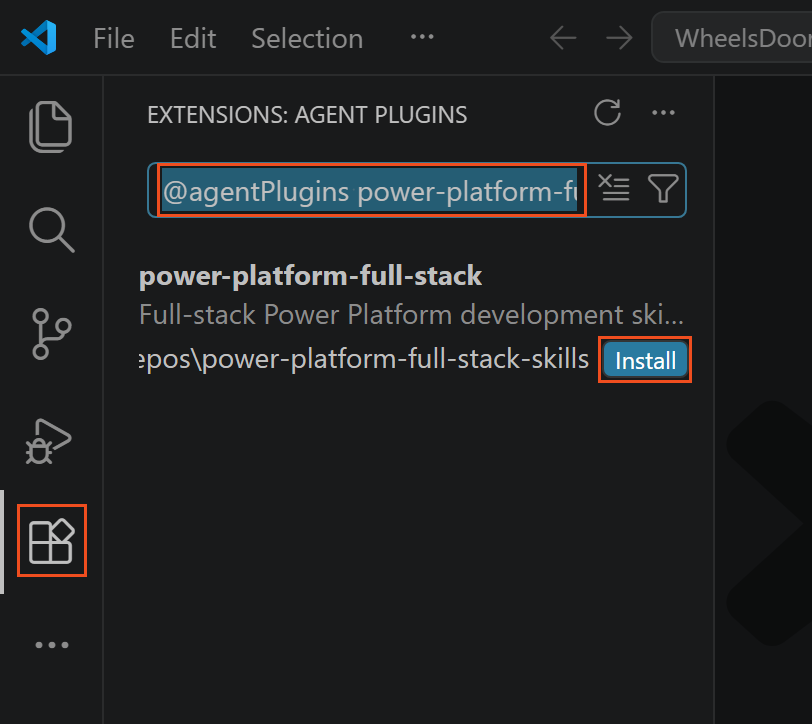

1. After installation, you should see the Power Platform agents available in the agent picker dropdown at the top of the Copilot Chat panel. Look for agents prefixed with **[Power Platform]**, such as **[Power Platform] Consultant**, **[Power Platform] Developer**, and **[Power Platform] Code Reviewer**.

   If you see the Power Platform agents listed, the plugin is installed correctly.

## ✅ Task 2 : Enable the Dataverse MCP Server in your environment

Before VS Code can connect, the Dataverse MCP server must be enabled for your environment and the **Microsoft GitHub Copilot** client must be allowed.

### 👉 Enable the MCP server feature

1. Open your workshop browser profile and navigate to the [Power Platform admin center](https://admin.powerplatform.microsoft.com/).

1. In the left navigation, select **Manage** → **Environments**.

1. Select the **environment** you want to connect to (your default developer environment from Lab Prerequisites).

1. In the command bar, select **Settings**.

1. Expand **Product**, then select **Features**.

1. Scroll down to the **Dataverse Model Context Protocol** section.

1. Check **both** checkboxes:

   - ✅ **Allow MCP clients to interact with Dataverse MCP server (GA version)**
   - ✅ **Allow MCP clients to interact with Dataverse MCP server (Preview version)**

   The Preview version gives access to newer MCP capabilities that are still rolling out. Enabling both ensures you have the widest tool coverage.

1. Select **Save**   
   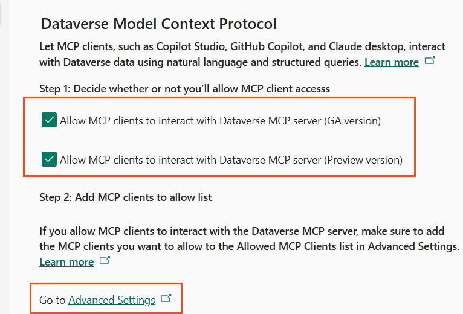  

### 👉 Enable the GitHub Copilot client

1. Under **Step 2: Add MCP clients to allow list**, select **Go to Advanced Settings**. This opens a new tab.

1. You'll see a list of **Active Allowed MCP Clients** with three entries:

   | Name | Unique Name |
   |------|-------------|
   | Dataverse MCP CLI tool | dataversemcpcli |
   | Microsoft Copilot Studio App | microsoftcopilotstudio |
   | **Microsoft GitHub Copilot App** | microsoftgithubcopilot |

   Select **Microsoft GitHub Copilot App** to open its record.

1. On the MCP client record, confirm that **Is Enabled** is set to **Yes**. If it isn't, set it to **Yes**.  

1. Select **Save & Close**.  
   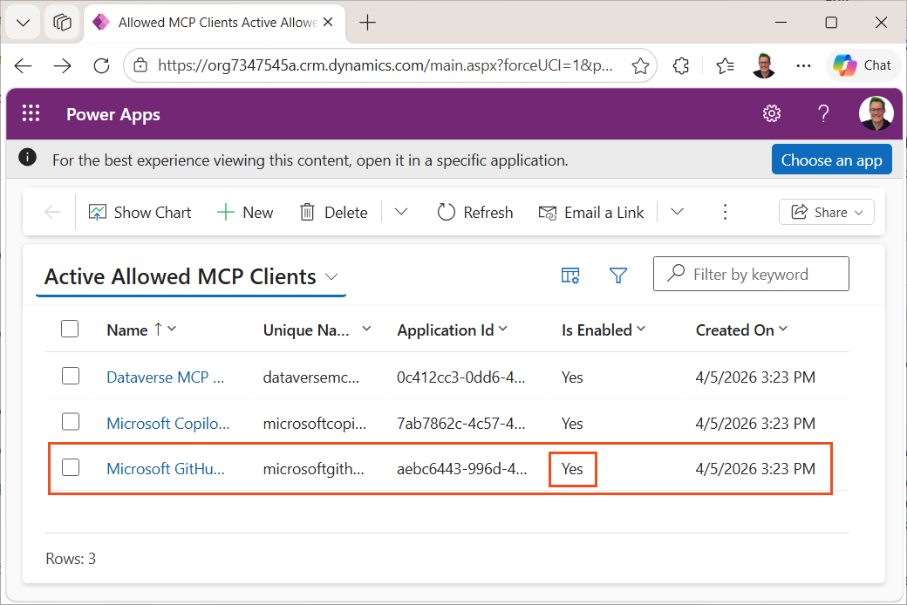
   
> [!TIP]
> By default, the Dataverse MCP server is enabled for Copilot Studio only. The **Advanced Settings** step is what allows non-Copilot Studio clients — like VS Code with GitHub Copilot — to connect. Without this step, VS Code will get authentication errors when trying to use the MCP server.

## ✅ Task 3 : Get your environment URL from Power Apps

You need your Dataverse instance URL to configure the MCP server connection in VS Code. The easiest way to get this is from the **Session details** dialog in Power Apps.

### 👉 Copy the Instance URL

1. In your workshop browser profile, navigate to [make.powerapps.com](https://make.powerapps.com).

1. Make sure you have the correct environment selected in the environment picker (top right).

1. Select the **gear icon** (⚙️) in the top-right corner of the page to open **Settings**.

1. Select **Session details**.

1. In the Session details dialog, find the **Instance url** field. It will look something like `https://org1a2b3c4d.crm.dynamics.com`.  
   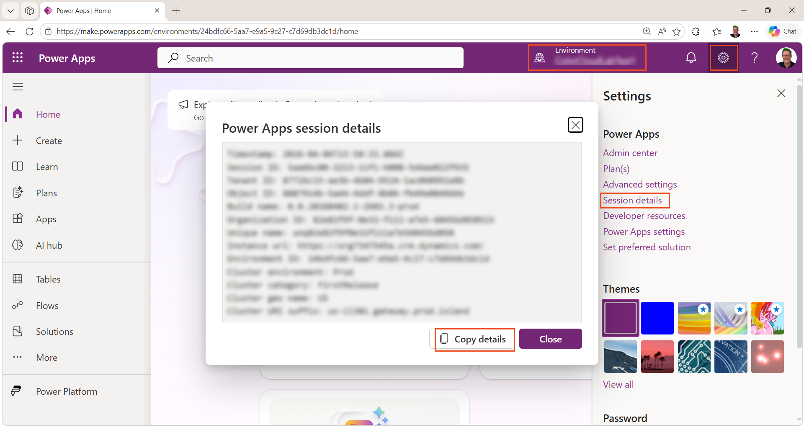
   
1. Select **Copy details** to copy all session details to your clipboard — the Instance URL is included in the copied text.

> [!TIP]
> You can also just select and copy the Instance URL directly. The important thing is to get the base URL (e.g. `https://org1a2b3c4d.crm.dynamics.com`) — you'll use it in the next steps.

## ✅ Task 4 : Import the sample solution using GitHub Copilot

In later labs you'll build generative pages and apps against an **Event Schedule Designer** sample solution. Rather than importing it manually through the maker portal, you'll let GitHub Copilot do it using the PAC CLI — your first taste of Copilot running real Power Platform commands.

### 👉 Turn off auto tool approval

Before you start, make sure Copilot asks for your approval before running terminal commands. You want to **see** each command before it executes — this is a learning exercise.

1. In VS Code, open **GitHub Copilot Chat** (`Ctrl+Alt+I`) if it is not already open, and make sure you're in **Agent** mode.

1. In the chat input, type the following slash command and press **Enter**:

   ```text
   /disableAutoApprove
   ```

   This ensures that every tool call — file reads, writes, terminal commands — requires your explicit approval before it runs.

> [!NOTE]
> VS Code has several slash commands for controlling tool approval:
> - **`/autoApprove`** (or **`/yolo`**) — auto-approves all tool calls globally without confirmation dialogs
> - **`/disableAutoApprove`** (or **`/disableYolo`**) — turns auto-approve off, requiring manual confirmation
>
> You can also set the permission level using the **permissions picker** (shield icon) at the bottom of the chat input area: **Default Approvals**, **Bypass Approvals**, or **Autopilot** (which also auto-responds to questions).
>
> For this task, we want Default Approvals so you can see and approve each PAC CLI command before it runs.

### 👉 Ask Copilot to import the solution

1. In the chat input, paste the session details you copied in Task 2 and ask Copilot to import the sample solution. Type something like:

   ```text
   I need to import a sample solution into my Power Platform environment. The solution zip file is at c:\colorcloud\Dist\EventScheduleDesigner_1_0_0_0_managed.zip. Here are my environment details:

   [paste the session details you copied from Power Apps]

   Please authenticate to this environment using PAC CLI and import the solution.
   ```

1. Press **Enter**.

1. Copilot will plan a sequence of PAC CLI commands. For each command, it will show you what it wants to run and ask for confirmation. You'll typically see:

   **Step 1 — Authenticate:** Copilot will propose something like:

   ```
   pac auth create --environment https://org1a2b3c4d.crm.dynamics.com
   ```

   Review the command — it's creating a PAC CLI authentication profile pointed at your environment URL (extracted from the session details you pasted). Select **Allow** to run it.  
   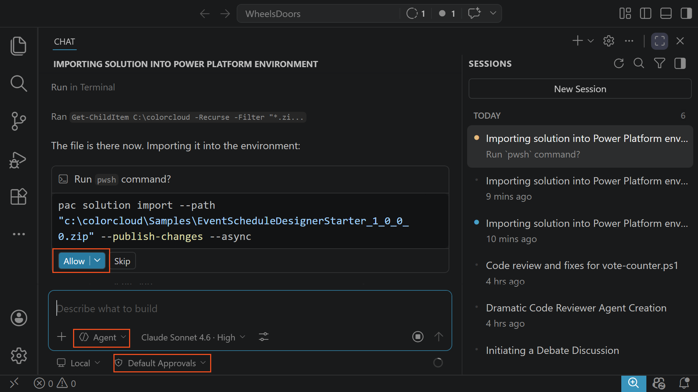

> [!NOTE]
> A browser window may open for interactive authentication. Sign in with the same account you use for Power Apps. This creates an auth profile that PAC CLI will use for all subsequent commands.

   **Step 2 — Import the solution:** Copilot will propose:

   ```
   pac solution import --path c:\colorcloud\Dist\EventScheduleDesigner_1_0_0_0.zip
   ```

   Review and select **Allow**. The import may take a minute or two.

1. Watch the terminal output inline in the chat. You should see the import progress and eventually a success message.

> [!TIP]
> If the import fails, check:
> - The solution zip file exists at the specified path
> - You authenticated to the correct environment
> - The environment has Dataverse enabled (developer environments always do)
>
> You can ask Copilot to troubleshoot: *"The import failed — can you check what went wrong?"*

> [!NOTE]
> This is the pattern you'll use throughout the workshop — describe what you want to accomplish, provide the context (environment details, file paths), and let Copilot figure out the right commands. You reviewed and approved each step, so you always know what's happening. As you get more comfortable, you can switch to Bypass Approvals to skip the confirmation clicks.

## ✅ Task 5 : Connect the Dataverse MCP server in VS Code

Now you'll add the Dataverse MCP server to VS Code so that GitHub Copilot can talk directly to your Dataverse environment. We'll use the **Preview** endpoint (`/api/mcp_preview`) which gives access to the latest MCP capabilities.

There are two ways to do this — pick whichever you prefer:

| Option | When to use |
|--------|-------------|
| **Option A — Let Copilot do it** | The "vibe coding" way. You paste your session details into the chat and let the agent configure everything. Fastest if you trust the agent. |
| **Option B — Manual setup** | The "I want to understand what's happening" way. You use the Command Palette to add the server step by step. |

---

### Option A : Let GitHub Copilot set it up for you

This is the agent-first approach — you give Copilot the information it needs and let it configure the MCP server.

1. Switch back to **Visual Studio Code** (the WheelsDoors workspace should still be open from Lab 1 — that's fine, we'll use it for this setup).

1. Open **GitHub Copilot Chat** (`Ctrl+Alt+I`) if not already open and make sure you're in **Agent** mode. Start a new chat.

1. In the chat input, paste the session details you copied earlier and ask Copilot to set up the MCP server. For example:

   ```text
   Set up the Dataverse MCP server (preview version) for my environment. Here are my session details:
   
   [paste the session details you copied from Power Apps]
   ```

1. Copilot read the Dataverse MCP setup skill, and will extract the Instance URL from your pasted session details and configure the MCP server for you. It will:
   - Create or update `.vscode/mcp.json` with the correct URL (using `/api/mcp_preview`)
   - Prompt you to authenticate if needed

1. You may see a diff view showing the new `.vscode/mcp.json` file. **Review and accept** the changes.  
   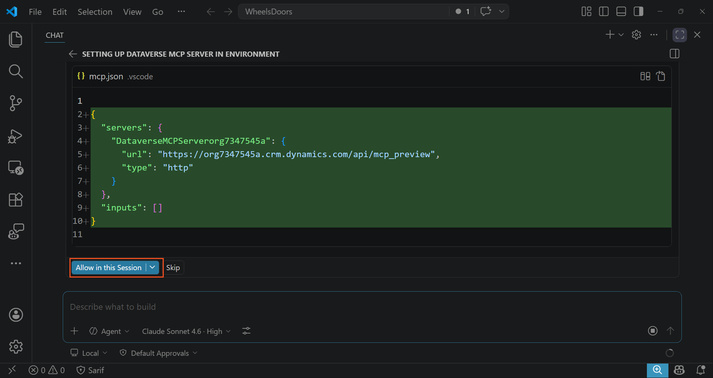

> [!TIP]
> This is a great example of the agent workflow — instead of learning the exact steps for a configuration task, you describe what you want and provide the context (session details). The agent figures out the rest. The Power Platform Full Stack Skills plugin includes knowledge about MCP server configuration, so Copilot knows the right URL format and file structure.

3. **Accept** the new `mcp.json` file that Copilot has created.

1. Skip ahead to **Verify the connection** below.

---

### Option B : Manual setup using the Command Palette

This approach walks you through each step so you understand exactly what's being configured.

1. Switch back to **Visual Studio Code** (the WheelsDoors workspace should still be open from Lab 1 — that's fine, we'll use it for this setup).

1. Open the **Command Palette** with `Ctrl+Shift+P`.

1. Type **MCP: Add Server** and select it from the list.

   

1. Select **HTTP or Server Sent Events** and press **Enter**.

1. Paste your Instance URL from the previous step and append `/api/mcp_preview` to the end.

   For example, if your Instance URL is `https://org1a2b3c4d.crm.dynamics.com`, enter:

   ```
   https://org1a2b3c4d.crm.dynamics.com/api/mcp_preview
   ```

   Press **Enter**.

> [!NOTE]
> We're using `/api/mcp_preview` (not `/api/mcp`) to get the Preview version of the MCP server. This matches the **Preview version** checkbox you enabled in Task 1. The Preview endpoint includes newer tools and capabilities that are still rolling out.

1. You'll be prompted for a **server name**. Enter `Dataverse` (or any name you prefer) and press **Enter**.

1. VS Code will generate the MCP server configuration. You'll see a new entry in `.vscode/mcp.json` that looks like:

   ```json
   {
     "servers": {
       "Dataverse": {
         "type": "http",
         "url": "https://org1a2b3c4d.crm.dynamics.com/api/mcp_preview"
       }
     }
   }
   ```

1. You may be prompted to **sign in** — a browser window will open for Microsoft authentication. Sign in with the same account you use for Power Apps.

> [!NOTE]
> The MCP server uses your existing Microsoft identity for authentication. You sign in once, and VS Code maintains the session. If you're already signed into VS Code with the same Microsoft account, it may authenticate automatically.

---

### 👉 Verify the connection

1. Open the `.vscode/mcp.json` configuration file.

1. Select **Start** just above the Dataverse MCP configuration node.  
    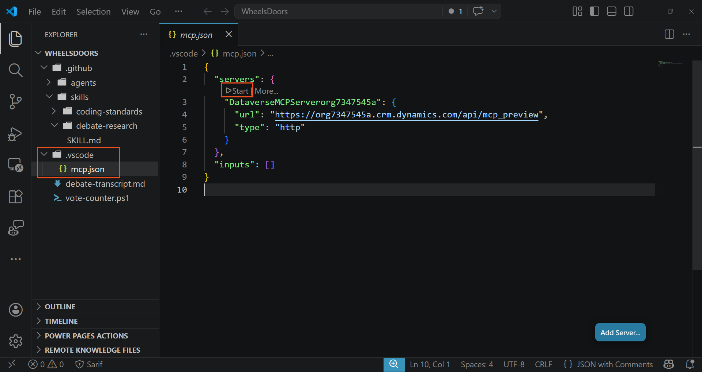

1. When prompted, Allow the MCP server to login and select your username when prompted.  
    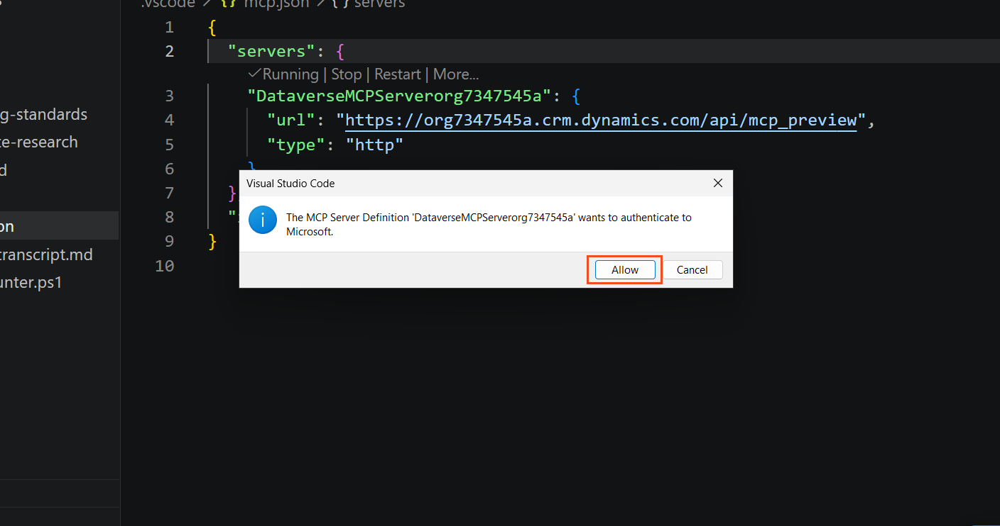

1. Select **More...** -> **Show Output**. You should eventually see a message that 13 tools have been discovered.  
    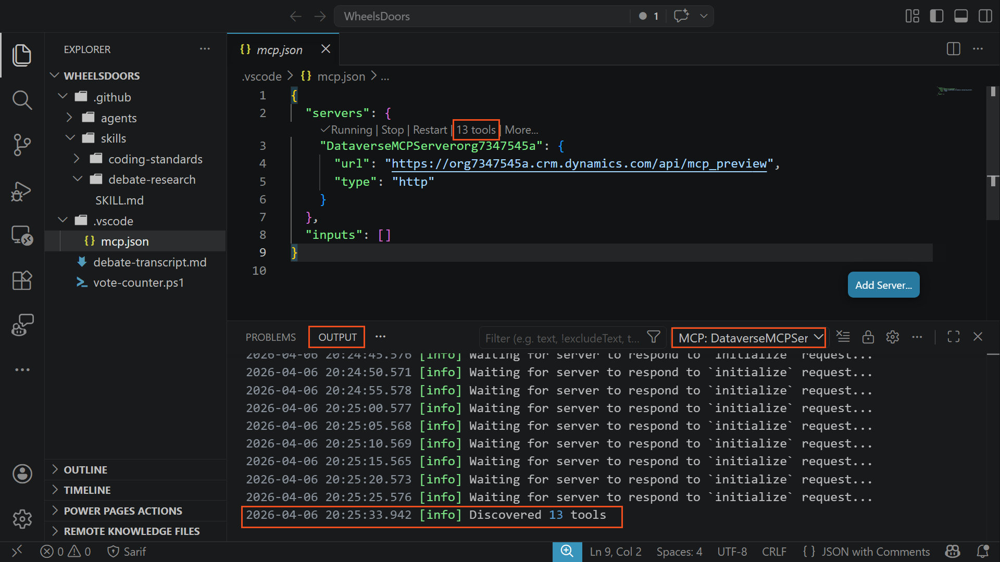

1. Open **GitHub Copilot Chat** (`Ctrl+Alt+I`) and make sure you're in **Agent** mode.

1. In the chat input, type:

   ```text
   List the tables in my Dataverse environment
   ```

1. Press **Enter**. Copilot will use the Dataverse MCP server to query your environment and return a list of tables.  
   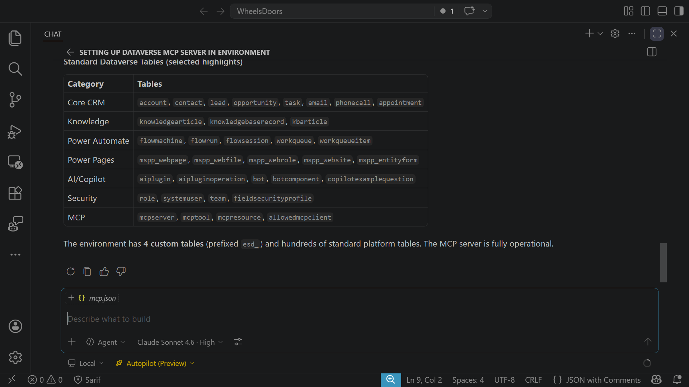

> [!TIP]
> If you see an error about the MCP server not being available, check:
> - The MCP server URL is correct (ends with `/api/mcp_preview`)
> - The **Microsoft GitHub Copilot** client is enabled in the admin center Advanced Settings
> - You're signed into VS Code with the same account that has access to the environment
> - Try restarting VS Code if the connection was just configured

1. Try a few more queries to explore what the MCP server can do:

   ```text
   Describe the Event table
   ```

> [!NOTE]
> The Dataverse MCP server gives Copilot **read and write** access to your environment's data through natural language. Notice how Copilot can see the custom tables that you imported in Task 3. In later labs, you'll use this connection when building generative pages and apps against these tables.

## ✅ Task 6 : Create sample data using natural language

The event tables are empty after import. Instead of manually creating records in the maker portal, you'll ask Copilot to populate them with realistic sample data using the Dataverse MCP server. Copilot will auto-discover the tables, columns, relationships, and option sets — you just describe what you want.

### 👉 Ask Copilot to create sample data

1. Select the permissions mode as **Bypass Approvals**.

1. In the Copilot Chat panel (still in Agent mode), type a prompt like this:

   ```text
   Create sample data in my Dataverse environment for the event scheduling tables (esd_event, esd_room, esd_session, esd_scheduleslot). First describe the tables to discover the columns and relationships, then create realistic sample data for the Power Platform conference space. Create at least 3 events, realistic rooms per event, at least 5 sessions per event with real Power Platform topics and speaker names, and schedule slots placing the sessions into rooms at sensible times.
   ```

   Press **Enter**. Your agent will likely ask you questions to confirm the data creation.  
   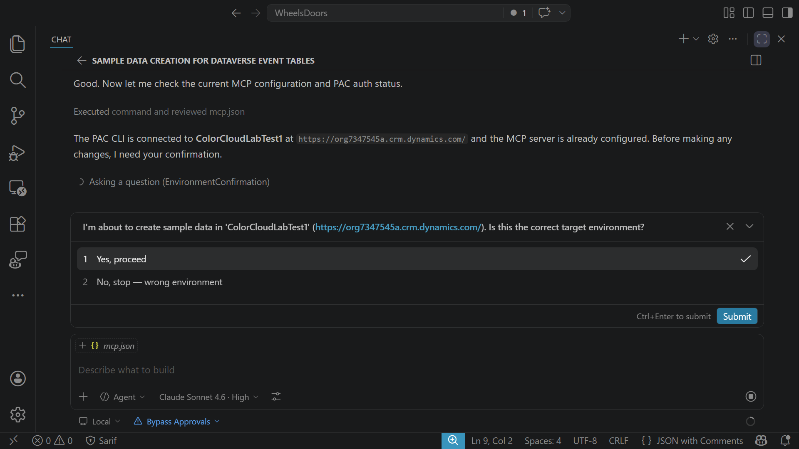

> [!TIP]
> This is just a suggestion — feel free to change the scenario to something that interests you.

1. Watch Copilot work through the process. It will:
   -  **Describe each table** to discover the columns, data types, and relationships (you'll see expandable MCP tool calls for each)
   - **Create data**

1. Expand the tool call nodes to see exactly what data Copilot is sending to Dataverse. Notice how it:
   - Discovered the lookup relationships automatically
   - Used the correct option set values for status fields
   - Created records in the right order to satisfy foreign key relationships

> [!NOTE]
> This is the power of the MCP server combined with Agent Mode — Copilot doesn't need you to tell it the column names, data types, or relationship structure. It queries the schema, understands the dependencies, and creates records in the correct order. You described the *intent* ("realistic event scheduling data for a Power Platform conference") and the agent figured out the *implementation*.

### 👉 Verify the data

1. Ask Copilot to confirm what was created:

   ```text
   Show me a summary of all the sample data you just created — how many records in each table?
   ```

1. You can also verify in the maker portal: go to [make.powerapps.com](https://make.powerapps.com), select **Tables** in the left navigation, find the **Event** table, and select **Data** to see the records.

> [!TIP]
> If Copilot created data you don't like, you can ask it to delete and recreate it: *"Delete all the sessions and create new ones with different topics and speakers."* The MCP server supports full CRUD operations.

## 🏁 What you learned

In this lab you connected GitHub Copilot to your Power Platform environment:

| Concept | What you did |
|---------|-------------|
| **Dataverse MCP Server** | Enabled the MCP server feature (GA + Preview) in the Power Platform admin center — this exposes your Dataverse environment as an MCP endpoint |
| **MCP client enablement** | Used Advanced Settings to allow the **Microsoft GitHub Copilot App** client specifically — required for non-Copilot Studio clients |
| **Instance URL** | Retrieved your environment URL from Power Apps **Settings → Session details → Copy details** |
| **Solution import via Copilot** | Used GitHub Copilot in Agent Mode to run PAC CLI commands (`pac auth create`, `pac solution import`) — reviewing and approving each command before it ran |
| **MCP: Add Server** | Used either Copilot (Option A) or the VS Code Command Palette (Option B) to register the Dataverse MCP server with the URL pattern `{instance-url}/api/mcp_preview` |
| **Natural language queries** | Asked Copilot about your tables and data — including the imported event scheduling tables — using MCP tools to query Dataverse directly |
| **Sample data creation** | Used Copilot + MCP to create realistic event scheduling sample data — Copilot auto-discovered schemas, relationships, and option sets, then created records in dependency order |

You now have a live connection between GitHub Copilot and your Dataverse environment, with an event scheduling sample solution ready to go. In the next labs, you'll use this connection to build generative pages and apps against the event scheduling tables.
