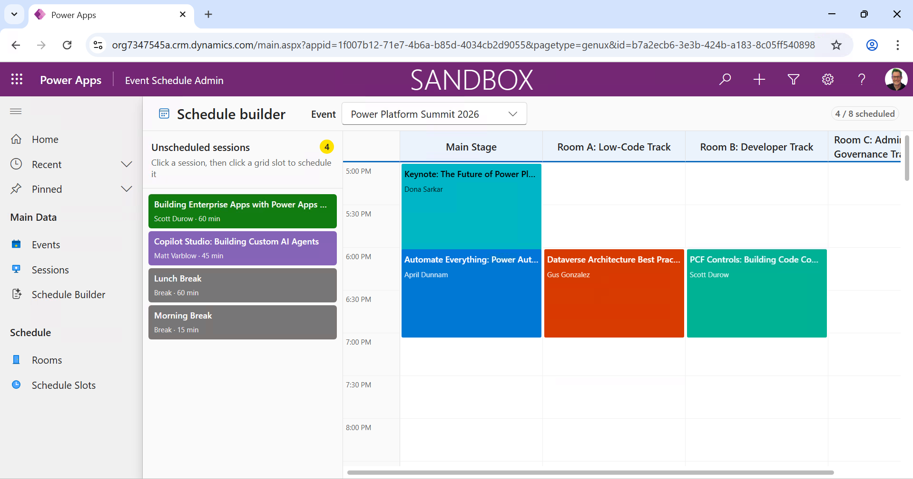

# 🚀 Lab 3: Generative Pages

Time to complete: **~60 minutes**

In this lab you'll use **GitHub Copilot in VS Code** to build and deploy a **generative page** — a custom page that runs inside a model-driven app. You don't need to be a developer to do this. You describe what you want in plain English, and Copilot generates the code, deploys it, and verifies it in the browser. You'll use the **gen pages skill** from the Power Platform Full Stack Skills plugin, which handles the entire workflow for you.

The scenario: the sample solution you imported in Lab 2 includes an **Event Schedule Builder** — events, sessions, rooms, and schedule slots. The standard forms and views let you manage the data, but what's missing is a visual **schedule builder page** where an organizer can see all unscheduled sessions and assign them to rooms and time slots. That's what you'll build.

> [!NOTE]
> **Generative pages via external tools** are now **GA worldwide**. You describe what you want, Copilot generates the code, and deploys it to your model-driven app via PAC CLI. This is the approach we'll use in this lab.
>
> Inside the model-driven app designer there's also a **"Describe a page"** dialog (GA in the US) where you describe a page in natural language and the AI generates it directly in the browser. That's a managed approach — fast, but gives you less control. We won't use it today, but it's worth knowing it exists.
>
> Separately, **Plan Designer** is a prompt-first experience for creating an entire model-driven app from scratch — user requirements, data model, technology proposals. In this lab we already have the solution from Lab 2, so we don't need Plan Designer.
>
> For the full official documentation on the external tools approach, see: [Generative pages with external tools](https://learn.microsoft.com/en-us/power-apps/maker/model-driven-apps/generative-page-external-tools).

> [!IMPORTANT]
> **AI output is non-deterministic.** The prompts in this lab are suggestions — the agent may follow a different path, ask clarifying questions, or produce different code each time. That's normal. If a prompt doesn't produce the result described, rephrase it, give the agent more context about what you're seeing, or try a different angle. The goal is the outcome, not the exact words. Treat the suggested prompts as starting points, not scripts.

## ✅ Task 1 : Open a new workspace for the gen page

You'll work in a dedicated folder for this lab. The gen pages skill generates code files — keeping them in their own workspace keeps things clean.

### 👉 Create a workspace folder

1. Open **Visual Studio Code**.

1. Open **GitHub Copilot Chat** (`Ctrl+Alt+I`) and make sure you're in **Agent** mode.

1. Start a new Chat.

1. Ask Copilot to create and open a workspace folder:

   ```text
   Create a folder c:\colorcloud\genpage and open it reusing this vscode instance
   ```

1. Select **Continue** to let Copilot run the commands. VS Code will reopen with the new empty folder as the workspace root.

> [!TIP]
> If VS Code asks you to trust the folder, select **Yes, I trust the authors**.

## ✅ Task 2 : Verify prerequisites and authenticate

The gen pages skill requires PAC CLI and Node.js. Let's verify everything is set up.

### 👉 Check PAC CLI authentication

1. In Copilot Chat (Agent mode), type:

   ```text
   Check that pac is authenticated against the environment:
   
   [Paste your environment details from Lab 2]
   ```

1. Copilot will run the commands to check the current auth profile, and login if needed.

> [!TIP]
> If you have problems authenticating, you can ask Copilot to:
>
> ```text
> Authenticate to my environment using pac auth create --deviceCode --environment https://<yourorg>.crm.dynamics.com
> ```
> Replace the URL with your actual environment URL from Lab 2.

### 👉 List the model-driven apps

1. Ask Copilot to find the model-driven app you'll deploy to:

   ```text
   What model-driven apps are in my environment?
   ```

1. You may see a popup login for the Azure CLI. Login using the workshop user.

1. Select **Focus Terminal** when you see it. If you are asked **Select a subscription and tenant**, simply press Enter.

1. You should see a model-driven app named **Event Schedule Admin** from the sample solution. Make a note of the **App Name** - you will need this when creating the generative page.

## ✅ Task 3 : Set up the Playwright MCP server

The gen pages skill can automatically verify your deployed page by opening it in a browser. To enable this, you need the **Playwright MCP server** connected in VS Code.

### 👉 Add the Playwright MCP server

1. In Copilot Chat (Agent mode), type:

   ```text
   Add the Playwright MCP server to my VS Code configuration
   ```

1. Copilot will create or update the `.vscode/mcp.json` file with the Playwright server entry. Review and approve the change.

1. You should see the Playwright MCP server appear in the tools list. You can verify by checking the MCP servers in the VS Code status bar or by asking Copilot:

   ```text
   Is the Playwright MCP server connected?
   ```

> [!NOTE]
> The Playwright MCP server lets the agent open a real browser, navigate to URLs, take screenshots, and interact with the page. The gen pages skill uses this to verify that deployed pages render correctly — it's the automated QA step in the generate → deploy → verify → fix loop.

> [!IMPORTANT]
> When the agent opens the Playwright browser, it launches a **separate browser session** that doesn't share your existing browser profile's cookies. You will need to **sign in with your Microsoft account** when prompted. Watch for the sign-in prompt and complete it manually — the agent will wait and then continue.

## ✅ Task 4 : Generate the schedule builder page

Now you'll ask GitHub Copilot to build the schedule builder page. This is the core of the lab — describe what you want in plain English, and watch the agent do all the work: generate the code, deploy it to the model-driven app, and verify it in the browser. You don't need to understand the code it generates.

### 👉 Prompt Copilot to build the page

1. In Copilot Chat (Agent mode), start a new Chat, select **Bypass Approvals**, and make sure your model is set to **Claude Opus 4.6** — this is a complex task that benefits from the strongest reasoning model.

1. Type the following prompt:

   ```text
   Build a generative page called "Schedule Builder" for my model-driven app.
   
   I need a schedule builder where an event organizer can select and event and see all the unscheduled sessions in a sidebar and assign them to rooms and time slots. The main area should be a grid with rooms as columns and time slots as rows. Scheduled sessions should appear in the grid, color-coded. Clicking an empty slot with a session selected should schedule it there. Clicking a scheduled session should unschedule it.
   ```
   
1. Press **Enter** and watch Copilot work.

### 👉 Watch the agent work through the gen pages workflow

The gen pages skill follows a structured workflow. Watch for each phase:

1. **Prerequisites check** — Copilot verifies Node.js and PAC CLI are available.

1. **Authentication** — Confirms the active PAC CLI profile and target environment.

1. **Schema generation** — Copilot reads the actual column names from your Dataverse tables so it knows exactly what fields exist. This is the critical step — the skill **never guesses** column names.

> [!NOTE]
> Custom table columns have unpredictable prefixed names (like `esd_sessiontitle` or `cr69c_starttime`). By reading the schema first, Copilot avoids the #1 source of errors.

1. **Code generation** — Copilot generates the page code, including the layout, data queries, and interactive scheduling logic. You'll see a `.tsx` file appear in the workspace.

> [!TIP]
> You don't need to understand the code. The skill handles the technical details — React components, styling, data access — so you can focus on describing what you want the page to do.

1. **Deployment** — Copilot deploys the page using PAC CLI:

   ```
   pac model genpage upload --app-id <app-id> --code-file schedule-builder.tsx --name "Schedule Builder" --data-sources "esd_event,esd_session,esd_room,esd_scheduleslot" --add-to-sitemap
   ```

> [!TIP]
> The `--add-to-sitemap` flag adds the page to the model-driven app's left navigation automatically. Without it, the page would be deployed but not visible in the app's navigation.

1. **Browser verification** — Since the Playwright MCP server is connected (Task 3), Copilot opens the deployed page in a browser to verify it loads correctly. You'll see screenshots in the chat.

> [!IMPORTANT]
> When the Playwright browser opens, you'll need to **sign in with your Microsoft account** — the Playwright session doesn't share your existing browser cookies. Complete the sign-in when prompted, then let the agent continue. If sign-in fails or times out, don't worry — you can always verify the page manually in the browser.

### 👉 Review the deployed page

1. If the agent didn't open the page automatically, open your model-driven app in the browser:
   - Go to [make.powerapps.com](https://make.powerapps.com) → **Apps** → select the model-driven app → **Play**
   - Or navigate directly to the URL that Copilot provided after deployment

1. In the left navigation, you should see **Schedule Builder** as a new page.  
    

1. Select it and review the page. You should see:
   - The event name and dates at the top
   - A grid showing rooms as columns and time slots as rows
   - Unscheduled sessions in a sidebar
   - Any previously scheduled sessions shown in the grid

> [!NOTE]
> The first generation may not be perfect — the layout might need tweaking, the colors might not be ideal, or the interaction might not work exactly as described. That's normal and expected. The next task is all about iterating.

## ✅ Task 5 : Iterate on the page

This is where generative pages really shine — you can iterate through natural language, refine the UI, and redeploy in seconds.

### 👉 First iteration — improve the layout

1. After reviewing the deployed page, go back to Copilot Chat and describe what you want to change. For example:

   ```text
   The grid rows are too tall — make them more compact. Add a colored left border on scheduled sessions to show which track they belong to. Show each session's duration in the sidebar, and add a "X of Y sessions scheduled" count at the top.
   ```

1. Copilot will update the `.tsx` file and redeploy. Watch for the diff in the editor — you can review exactly what changed.

1. Check the updated page in the browser (refresh or navigate back to it).

### 👉 Second iteration — make changes persist

1. If the click-to-schedule interaction isn't saving to Dataverse yet, ask Copilot to fix it:

   ```text
   The scheduling interaction isn't saving yet. When I assign a session to a slot it should save to Dataverse, and when I remove a session it should delete the record. Make it persist.
   ```

1. Copilot will update and redeploy the page.

1. Test in the browser — select a session from the sidebar, click an empty time slot, and verify the session appears in the grid. Click a scheduled session to remove it. Refresh the page to confirm changes persisted.

> [!NOTE]
> Each iteration follows the same cycle: describe the change → Copilot updates the code → redeploy → verify in browser. The skill handles the technical details automatically — you focus on describing what you want.

### 👉 Bonus iterations (if time allows)

Try some of these improvements:

| What to ask | What it adds |
|-------------|---------------------|
| *"Add a confirmation dialog before unscheduling a session"* | A safety prompt so users don't accidentally remove sessions |
| *"Show a tooltip when hovering over a session in the grid with the full description and speaker name"* | Richer information on hover |
| *"Add a filter dropdown to filter the sidebar by session type"* | A way to narrow down sessions |
| *"Highlight time conflicts — if two sessions with the same speaker overlap in different rooms, show a warning"* | Visual warnings for scheduling mistakes |

> [!TIP]
> Each iteration takes 1-2 minutes. You can iterate 5-10 times in the time available. Notice how you're describing **what** you want — not **how** to build it. Copilot handles the technical implementation.

## ✅ Task 6 : Take a look at the generated code

You don't need to understand every line, but it's worth taking a quick look at what Copilot built. This helps you appreciate what the agent handled for you — and builds confidence that the code is real and inspectable, not a black box.

### 👉 Open the page file

1. In VS Code, open the generated `.tsx` file (e.g. `schedule-builder.tsx`).

1. Scroll through it. You'll notice:
   - It's a **single file** containing everything the page needs — layout, styling, data queries, and interaction logic
   - It references your **actual Dataverse column names** (the ones with prefixes like `esd_sessiontitle`) — not guesses
   - It uses **Fluent UI** — the same design system as Microsoft 365 — so the page looks native inside the model-driven app

> [!NOTE]
> You don't need to be able to write this code. The key takeaway is that Copilot generated production-quality code from your plain English description — and you can always ask it to change anything by describing what you want differently.

### 👉 Open RuntimeTypes.ts

1. Open `RuntimeTypes.ts` and skim through it. This is the schema file that was generated from your Dataverse metadata — it's how Copilot knew the correct column names.

> [!TIP]
> If you add columns to a table later, the skill regenerates this file automatically so the code always stays in sync with your data model.

## 🏁 What you learned

In this lab you built and deployed a generative page using GitHub Copilot and the external tools approach:

| Concept | What you did |
|---------|-------------|
| **Describe, don't code** | Built a complete interactive page by describing what you wanted in plain English — Copilot handled all the technical implementation |
| **Schema-aware generation** | The skill read your actual Dataverse metadata first, so the generated code used the correct column names — no guessing |
| **One-click deployment** | The skill deployed the page to your model-driven app and added it to the navigation automatically |
| **Iterative refinement** | Refined the page through multiple natural language prompts — each iteration updated and redeployed in about a minute |
| **Browser verification** | Connected the Playwright MCP server so the agent could open, screenshot, and verify the deployed page automatically |
| **Inspectable code** | The generated code is real, readable, and maintainable — not a black box. You can always ask Copilot to explain or change any part of it |

You now have a working schedule builder page deployed inside a model-driven app — built entirely through GitHub Copilot and PAC CLI. In the next block, we'll move up the spectrum to planning with multi-agent teams before building a full Code App.
